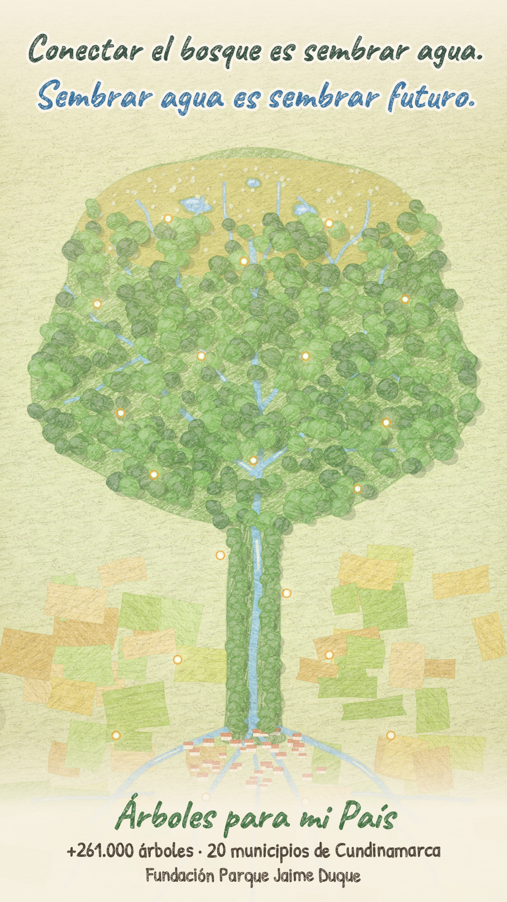
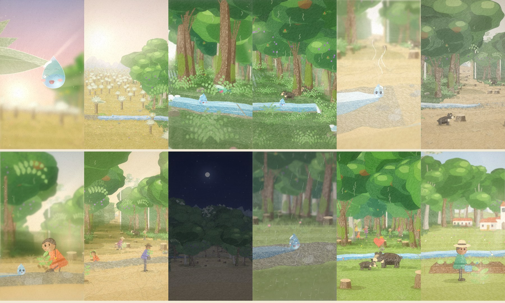

# Árboles para mi País — *Sembrar agua* (versión 4, 41 s)

Filminuto animado de **41 segundos**, vertical **9:16 (1080 × 1920, 24 fps)**, **dibujado cuadro a cuadro con
JavaScript** con textura de **lápiz de color sobre papel**, cámara 2.5D con perspectiva real, profundidad de campo,
luz volumétrica y **música original sintetizada también en JavaScript**. Responde al reto de la Fundación Parque
Jaime Duque: mostrar por qué reconectar los ecosistemas y proteger las fuentes de agua también es sembrar futuro.

**Video final:** [`out/v4/sembrar_agua_41s.mp4`](out/v4/sembrar_agua_41s.mp4) (H.264 + AAC, −14 LUFS)
**Banda sonora:** [`out/v4/banda_sonora.wav`](out/v4/banda_sonora.wav)

<p align="center"></p>



---

## La historia

Al amanecer, en la punta de la hoja plateada de un **frailejón**, el rocío del páramo se junta y nace una **gota**.
Abre los ojos, mira el sol, se estira y cae. Rebota en el musgo, entra al nacimiento y la cámara se abre: el
páramo entero es una fábrica de agua.

La gota baja por la quebrada entre el **bosque de niebla**: cascadas, haces de luz, un **colibrí** que la saluda,
un **osezno de anteojos** que bebe junto a su madre. Pero el bosque se acaba de golpe: tocones, tierra agrietada,
un sol blanco. El agua se adelgaza y la gota queda atrapada en el barro y **se evapora**. El osezno mira al otro
lado del potrero: su madre está lejos, en otro pedazo de bosque, y no hay cómo llegar.

Entonces cae una sombra: una **niña** se arrodilla y siembra una plántula junto a la gota. Detrás de ella baja
la **comunidad** con palas y plántulas, y siembran a lo largo de la quebrada **al compás de la música**.
Pasan los días y las noches (un *time-lapse* con el sol, la luna y las estrellas), los árboles crecen y llaman
a las nubes. **Llueve**, y ahora el suelo guarda el agua: la gota se recarga, la quebrada vuelve a correr por el
nuevo **corredor ecológico**, sale un arcoíris y el osezno cruza el corredor hasta su madre.

La gota sigue río abajo hasta el pueblo, donde un niño intenta regar su huerto con una regadera vacía: la gota
salta, cae sobre la semilla y la hace brotar. La cámara sube, atraviesa las nubes y revela la imagen final:
vista desde lo alto, **la cuenca entera es un árbol** — el páramo y los bosques son la copa, las quebradas las
ramas, el río el tronco y los canales del valle las raíces. La copa se llena de hojas y se encienden
**20 luces: los 20 municipios**.

> *Conectar el bosque es sembrar agua. Sembrar agua es sembrar futuro.*

Casi sin texto: todo se cuenta con imágenes, y las únicas palabras llegan al final.

## Guion por planos

| Tiempo | Plano | Qué se ve | Música / sonido |
|---|---|---|---|
| 0–3,4 s | **Rocío** (macro) | Contraluz del amanecer; el rocío se junta en la hoja afelpada del frailejón y nace la gota. Abre los ojos, mira el sol. | Pad aéreo, campanitas que suben, la quena saluda al sol. |
| 3,4–6 s | **Páramo** | Cae, rebota en el musgo, entra al nacimiento; la cámara se abre al páramo con sus frailejones. | Bombo y rasgueo de tiple: el paisaje se revela. |
| 6–13 s | **Bosque de niebla** | Travelling lateral por cascadas, haces de luz, colibrí, osa y osezno bebiendo. El bosque termina. | Bambuco con tiple, marimba, bajo y maracas. |
| 13–16,5 s | **El potrero** | La gota se evapora; el osezno, en primer plano, mira a su madre al otro lado del potrero seco. | Se apaga el ritmo: re menor, chicharras, quena triste. |
| 16,5–19,2 s | **La niña** | Una sombra; la niña siembra junto a la gota (contrapicado a contraluz); llega la comunidad. | Arpa, cuerdas, el ritmo vuelve de a poco. |
| 19,2–23 s | **Sembrar** | Travelling: ocho siembras, una en cada pulso. | Cada siembra es una nota de tiple que sube. |
| 23–26 s | **El tiempo** | *Time-lapse*: atardecer, noche con estrellas y luna, amanecer; los árboles crecen, se juntan las nubes. | Arpegios que se aceleran como un reloj de días, grillos. |
| 26–28,6 s | **Lluvia** | Relámpago, lluvia sobre el corredor; la gota se recarga con tres gotas. | Trueno, lluvia, redoble y tres notas brillantes. |
| 28,6–32 s | **Reencuentro** | La quebrada vuelve a correr; arcoíris; el osezno cruza la quebrada y abraza a su madre; la comunidad celebra. | Clímax: tema completo con quena, tiple, cuerdas y bombo. |
| 32–35 s | **Río abajo** | Hasta el pueblo; la regadera vacía; salto de la gota; brota la semilla. | Carrerita de marimba, silencio cómico, "boing", chispas. |
| 35–41 s | **La cuenca es un árbol** | Subida entre nubes y revelación del mapa-árbol; 20 luces; títulos. | Coro, cuerdas y quena; 20 campanitas; acorde final. |

## Cómo se cumplen las condiciones del reto

- **Duración:** 41 s (máximo 60 s). **Formato:** vertical 1080 × 1920.
- **Responde al reto:** páramo como fábrica de agua, fragmentación del bosque, siembra de especies nativas
  (roble, aliso, encenillo, sietecueros, cucharo), corredor ecológico, trabajo comunitario, protección de fuentes
  hídricas y las cifras del programa (+261.000 árboles, 20 municipios de Cundinamarca).
- **Música original:** compuesta y sintetizada en código (`film/audio/`): quena, tiple (Karplus-Strong), marimba,
  arpa, cuerdas, coro por formantes, bajo y bombo, a 120 BPM en Re mayor. Sin muestras ni grabaciones de terceros.
- **Sin contenido de terceros:** cada cuadro se dibuja con código; no hay fotos, videos ni ilustraciones ajenas.
- **Sin personas identificables:** los personajes son dibujos genéricos y no hay voces.
- **Tipografías:** *Caveat* y *Patrick Hand* (Google Fonts, SIL Open Font License 1.1; licencias en `assets/fonts/`).
- **Apto para todo público.**

## Técnica

Investigando cómo se hicieron las animaciones más celebradas hechas con Claude Opus 5.5 (repositorios y
publicaciones que recopilan esos trabajos), aparecen siempre las mismas ideas: **cada cuadro es una función pura
del tiempo**, **la música manda el montaje** (algo pasa en cada pulso), **luz y atmósfera** con pasadas en espacio
de pantalla, y **revisión cuadro a cuadro** con hojas de contacto antes del render final. Esta versión aplica
todas, sobre el estilo de lápiz de color de la versión anterior:

- **Cámara 2.5D con perspectiva real** (`film/engine/camera.js`): cámara estenopeica con desplazamiento de lente
  (las verticales siguen verticales, como en un dibujo). Un encuadre se define por "este punto del mundo debe verse
  aquí en pantalla, a esta distancia", y las trayectorias se interpolan con PCHIP.
- **Un mundo continuo** (`film/world/`): una cuenca vista de lado — páramo, bosque de niebla con cascadas, potrero,
  corredor, bosque y valle — con un terreno por capas paralelas al cauce (como papel recortado), vegetación
  sembrada de forma determinista, la quebrada con reflejo del cielo, corrientes y espuma, y el caudal que cambia
  con la historia.
- **Profundidad de campo** (`film/engine/stage.js`): todo se ordena por distancia y se pinta en tramos con el mismo
  desenfoque; lo lejano se funde con la bruma del cielo y lo cercano cae en sombra.
- **Luz** (`film/engine/post.js`, `light.js`): rayos crepusculares (difuminado radial desde el sol), haces de sol
  entre los árboles, motas de polvo, manchas de sol, *bloom*, destellos, borde luminoso a contraluz y un
  **guion de color** que interpola ambientes (amanecer, bosque, mediodía seco, esperanza dorada, noche, tormenta,
  después de la lluvia, tarde).
- **Motor de lápiz de color** (`film/core/pencil.js`): mosaicos de trazos con presión y "diente" del papel, bordes
  deshilachados y *boil* (el temblor del dibujo a mano). Se pintan con recorte + `drawImage`, cinco veces más rápido
  que un patrón de Skia en CPU.
- **Personajes** (`film/world/drop.js`, `bears.js`, `people.js`): la gota **refracta el paisaje** (el mundo se ve
  invertido dentro de ella), con cáusticas, brillo especular y ocho expresiones; oso andino y osezno con marcha,
  carrera y abrazo; comunidad con ruanas y sombreros que camina, cava, siembra y celebra.
- **Final** (`film/map.js`): la cuenca vista desde arriba, dibujada como un árbol que se llena de hojas.
- **Render paralelo** (`film/render.js`): cuatro procesos dibujan segmentos de 2 s; `film/build.js` une el video con
  la música normalizada a −14 LUFS en una codificación de dos pasadas.

## Cómo reproducirlo

Requisitos: Node 18+ y Python 3 (sólo para obtener ffmpeg con `pip install imageio-ffmpeg`).

```bash
npm install
pip install imageio-ffmpeg                   # o exporta FFMPEG=/ruta/a/ffmpeg

node --expose-gc film/build.js               # música + video + mezcla → out/v4/sembrar_agua_41s.mp4

# durante la edición
node film/audio/score.js                     # sólo la banda sonora
node --expose-gc film/still.js 1.5 20 39     # cuadros sueltos en out/stills/
STRIDE=4 node --expose-gc film/render.js     # vista previa rápida (1 de cada 4 cuadros)
node --expose-gc film/render.js 26 30        # re-renderizar un tramo
node film/build.js --mux-only                # volver a unir sin re-dibujar
```

## Estructura

```
film/
  story.js             guion: tiempos, gota, osos, comunidad, caudal, siembra, guion de color
  cameras.js           los planos y sus cámaras
  film.js              composición de cada cuadro (personajes, efectos, ajustes de luz)
  render-view.js       cielo → mundo → luz → etalonaje → papel
  map.js               revelación final: la cuenca es un árbol
  engine/              cámara, escenario con profundidad de campo, luz y postproducción
  world/               geografía, terreno, agua, cielo, flora, personajes, pueblo
  core/                motor de lápiz, papel, ruido, color, interpolación
  audio/               sintetizador y partitura
  render.js build.js still.js
src/                   versión 3 (40 s, vista cenital) — se conserva como referencia
out/v4/                video, banda sonora, póster y storyboard de esta versión
```

## Versión anterior

La versión 3 (40 s, cámara cenital sobre un mapa continuo) sigue en `src/` y su video en
[`out/arboles_para_mi_pais.mp4`](out/arboles_para_mi_pais.mp4). La versión 4 conserva su historia y su
técnica de lápiz, y la lleva a una puesta en escena cinematográfica: primeros planos con emoción, luz y
atmósfera, profundidad, una paleta que cuenta la historia y una partitura con arco dramático.
