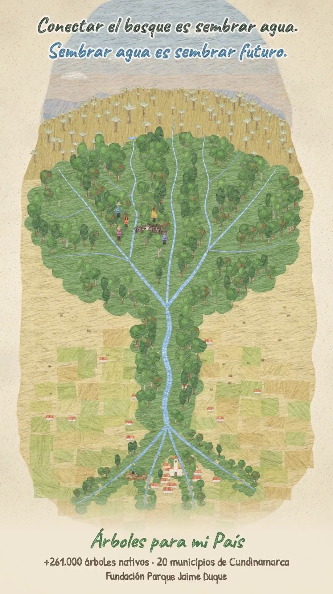
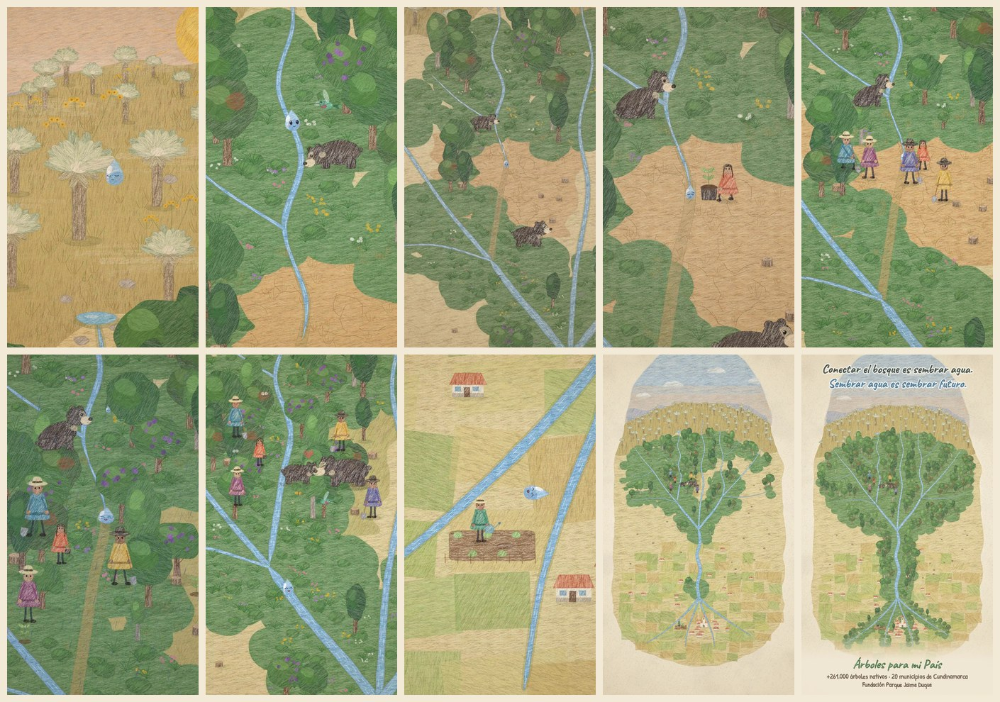

# Árboles para mi País — *Sembrar agua*

Filminuto animado de **40 segundos**, en formato **vertical 9:16 (1080 × 1920)**, dibujado cuadro a cuadro
con **JavaScript** y con textura de **lápiz de color sobre papel**. Responde al reto de la Fundación Parque
Jaime Duque: explicar por qué reconectar los ecosistemas y proteger las fuentes de agua también es sembrar futuro.

**Video final:** [`out/arboles_para_mi_pais.mp4`](out/arboles_para_mi_pais.mp4) (H.264 + AAC, 24 fps, 40 s)
**Banda sonora original:** [`out/banda_sonora.wav`](out/banda_sonora.wav)

<p align="center"></p>



---

## La idea

Una **gota de agua** nace de la niebla en la hoja de un frailejón del páramo y baja por la quebrada.
Atraviesa el bosque (un colibrí, un osezno de anteojos que bebe), pero el bosque se acaba: el potrero
talado está seco y la quebrada se corta. La gota queda atrapada en el barro y se evapora. Al otro lado,
la osa madre no puede llegar hasta su cría.

Entonces llega una niña con una plántula, y detrás de ella su comunidad. Siembran árboles nativos
(roble, aliso, sietecueros, encenillo) a lo largo de la quebrada. Llueve, y como ahora hay raíces y sombra,
el agua **se queda**: la gota revive, la quebrada vuelve a correr por el nuevo **corredor ecológico**
y la osa y el osezno se reencuentran.

La gota sigue río abajo hasta el pueblo, donde un niño intenta regar una semilla con una regadera vacía.
La gota salta, cae sobre la semilla y la hace brotar. La cámara se aleja y revela la imagen final: vista
desde lo alto, **la cuenca entera es un árbol**. El páramo y los bosques son la copa, la quebrada es el
tronco y los canales del valle son las raíces. Mientras aparecen 20 destellos (los 20 municipios), la
copa se llena de hojas.

> *Conectar el bosque es sembrar agua. Sembrar agua es sembrar futuro.*

Poco texto y mucha narrativa visual. Las únicas palabras están en el cierre.

## Guion por escenas

| Tiempo | Escena | Qué se ve | Qué cuenta |
|---|---|---|---|
| 0–6 s | **Páramo al amanecer** | Niebla entre frailejones; una gota se condensa, abre los ojos, cae y llega al nacimiento. | El páramo "fabrica" el agua. |
| 6–12 s | **El bosque** | La gota baja por la quebrada; un colibrí la saluda y un osezno bebe. | Bosque sano = agua que corre. |
| 12–16 s | **El potrero** | Tocones y tierra agrietada; la quebrada se corta, la gota se evapora. La osa y su cría quedan separadas. | La fragmentación rompe el agua y la vida. |
| 16–18 s | **Una plántula** | Una niña deja una plántula junto a la gota y llega la comunidad. | La esperanza llega por las personas. |
| 18–28 s | **Sembrar** | Doce árboles nativos se siembran al compás de la música. Crecen, llueve, el suelo guarda el agua y la quebrada revive. | Restaurar el corredor devuelve el agua. |
| 28–34 s | **Conexión** | Los osos se reencuentran por el corredor. La gota viaja al pueblo, ve la regadera vacía y riega una semilla. | Reconectar el ecosistema = agua para la gente. |
| 34–40 s | **Revelación** | La cámara se aleja y la cuenca resulta ser un árbol que se llena de hojas; aparecen 20 destellos. | +261.000 árboles, 20 municipios: sembrar futuro. |

## Cómo se cumplen las condiciones del reto

- **Duración:** 40 s, por debajo del máximo de 60 s.
- **Formato:** vertical 1080 × 1920.
- **Responde al reto:** páramo como fuente de agua, fragmentación, siembra de especies nativas, corredor ecológico,
  trabajo comunitario, protección de fuentes hídricas y cifras del programa (+261.000 árboles, 20 municipios de Cundinamarca).
- **Música original:** compuesta y **sintetizada en código** en este repositorio (`src/audio/`): tiple por modelado físico
  (Karplus-Strong), marimba, pad, bajo y percusión suave, a 120 BPM en Re mayor. No usa muestras ni grabaciones de terceros.
- **Sin contenido de terceros:** todos los cuadros se dibujan con código. No hay fotos, videos ni ilustraciones ajenas.
  Las referencias visuales solo sirvieron de inspiración para la técnica (el lápiz de color).
- **Personas identificables:** ninguna. Los personajes son dibujos genéricos y no hay voces.
- **Tipografías:** *Caveat* y *Patrick Hand*, de Google Fonts, con licencia SIL Open Font License 1.1 (uso libre;
  licencias en `assets/fonts/`).
- **Contenido:** apto para todo público y sin elementos ofensivos ni discriminatorios.

## Técnica

- **Todo es dibujo procedural en JavaScript** con [`@napi-rs/canvas`](https://github.com/Brooooooklyn/canvas) (Skia).
- **Motor "lápiz de color"** (`src/core/pencil.js`):
  - Mosaicos de trazos con varios ángulos, presión variable y el "diente" del papel. Cada color se tiñe
    a partir de máscaras compartidas.
  - Bordes deshilachados y un filo más oscuro, como cuando el lápiz se aprieta en la orilla.
  - *Boil* (el temblor del dibujo animado a mano): los personajes se redibujan a 12 dibujos por segundo y el paisaje a 6.
  - Papel crema con fibras, manchas y grano (`src/core/paper.js`).
- **Un solo mundo continuo** (`src/world/layout.js`): una pintura vertical de unos 3.000 × 6.000 px, como un rollo de paisaje.
  La cámara la recorre en un único plano secuencia, del páramo al pueblo, y al final la muestra completa.
- **Personajes y coreografía** (`src/world/characters.js`, `src/scene.js`): la gota (con *squash & stretch*), la osa y su osezno,
  el colibrí, los sembradores con ruana y sombrero, y el niño del huerto. Todos animados con curvas de easing,
  resortes y una cámara con interpolación monótona (PCHIP).
- **Render paralelo** (`src/render.js`): cuatro procesos dibujan segmentos de 2 s y ffmpeg los codifica.
  `src/build.js` los une con la música en una codificación de dos pasadas.

## Cómo reproducirlo

Requisitos: Node 18+ y Python 3 (solo para obtener ffmpeg con `pip install imageio-ffmpeg`).

```bash
npm install
pip install imageio-ffmpeg        # o bien exporta FFMPEG=/ruta/a/ffmpeg

node --expose-gc src/build.js     # música + video + mezcla → out/arboles_para_mi_pais.mp4 (~6 min con 4 núcleos)

# útiles durante la edición
node src/audio/render-audio.js              # solo la banda sonora
node --expose-gc src/still.js 3.3 25 39.9   # cuadros sueltos en out/stills/
node --expose-gc src/render.js 18 28        # re-renderizar un tramo
node src/build.js --mux-only                # volver a unir sin re-dibujar
```

## Estructura

```
src/
  timeline.js          guion temporal (todas las marcas de tiempo)
  scene.js             cámara, coreografía, efectos y composición de cada cuadro
  text.js              texto manuscrito con relleno de lápiz
  core/                motor de lápiz, papel, ruido, easing, interpolación
  world/               geografía, suelo/cielo/quebradas, flora y personajes
  audio/               sintetizador y partitura (música original)
  render.js build.js   render paralelo y codificación final
assets/fonts/          tipografías OFL
out/                   video final, banda sonora y póster
```
